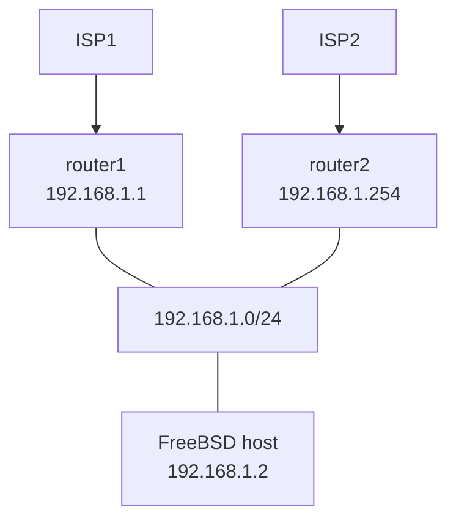

## Forwarding Information Base [fib](https://tex2e.github.io/rfc-translater/html/rfc3222.html) とは

- 要するに ルーターの転送情報ベース(フォワードする先が記されたデータベース) 
- FreeBSD では 7.1 から複数の FIB を持てるようになっていた
- FreeBSD の場合 プロセス単位の環境で FIB を選べるようになっている
- デフォルトでは、FIB は 1個で ID=0

## FreeBSD で FIB を管理する方法

1. kernel net.fibs: >2

- 必要条件: 関連の kernel変数:

       net.fibs: 1 (デフォルト = 1)    ←　これを 2以上にすれば使える
       net.inet.tcp.bind_all_fibs: 1
       net.inet.udp.bind_all_fibs: 1
       net.inet.raw.bind_all_fibs: 1
       net.my_fibnum: 0 (default = 0) 
       net.add_addr_allfibs: 0 (default = 0 )
       net.debugnet.fib: 0
       
       
    
2. route 設定について


2-1. [router1] がISP1 デフォルト利用だが、[router2]を追加してISP2のサービスも受けたい

- rc.conf

```conf

ifconfig_igb0="inet 192.168.1.2 netmask 255.255.255.0"
defaultrouter="192.168.1.1"

```

手作業で以下の設定をすれば FIB=1 のとき router2 経由でISP2に行く。

- sysctl -w net.fibs=2
- setfib 1 route add 192.168.1.0/24 -iface igb0  # この設定は必要。
- setfib 1 route add default 192.168.1.254 # ↑これをしておかないと FIB=1の設定が出来ない。

## ハマりどころ

### default route が設定できない

FIB導入の目的が達成されない... 

たとえば kernel変数を変更後、
  
  "setfib 1 netstat -r"  ←　はすぐに出来るので問題はないと思うが・・・
  "setfib 1 route add default xxxxx" 
とやってもなぜか動かない？？ということになる。

理由: 

```
"setfib 1 ifconfig inet 192.168.1.129/24 alias " などとFIB=1 環境で明示的に
インターフェイスを追加しない限り自動で 192.168.1.0/24　ネットワークへの経路は作られない。
よって、 192.168.1.0/24 を経て既定ルータ(default gw) の設定をすることは出来ない。
```  
###  jail (bastillebsd)

- jail 環境のサーバであってもプロセス単位で fib 番号を設定するため、デフォルトは 0 である

```console
bastille cmd jail sysctl -a  | grep fib

[jail]:
net.inet.tcp.bind_all_fibs: 1
net.inet.udp.bind_all_fibs: 1
net.inet.raw.bind_all_fibs: 1
net.route.algo.fib_max_sync_delay_ms: 1000
net.fibs: 2
net.my_fibnum: 0
net.add_addr_allfibs: 0
net.debugnet.fib: 0
backup# setfib 1 bastille cmd jail sysctl -a  | grep fib

[jail]:
net.inet.tcp.bind_all_fibs: 1
net.inet.udp.bind_all_fibs: 1
net.inet.raw.bind_all_fibs: 1
net.route.algo.fib_max_sync_delay_ms: 1000
net.fibs: 2
net.my_fibnum: 1
net.add_addr_allfibs: 0
net.debugnet.fib: 0

```
- setfib 1 bastille console jail とやれば、FIB=1 の設定で動く shell から動く
- jail.conf に exec.fib={{num}}; を追加すると FIB=1 でネットワーク構成される
- jail-host する側での設定としては、jail に渡す loopback端点が setfib 1 で初期化されていないので以下の設定を追加する 

jailnet="10.0.0.0/8" として
jailnet の 一箇所を jail-host側で出口として持つ (10.0.0.1)

```console
ifconfig {{loopback}} 10.0.0.1 alias
setfib 1 route add 10.0.0.0/8 -iface {{loopback}}

```

上記設定がない場合 jail loopback 設定がないまま jail が動くため外部には出られるがjailの中で閉じたネットワークが機能しないので注意すること。


### fib on jail vs VNET jail 

- fib は jail コンテナに関係なく動くため、FIB=fibnum で稼働したいコンテナのプロセスが在るなら " setfib {{fibnum}} " を被せて起動する必要あり
- VNETのほうが自由度は高く、fibを使わずに VNETで分けるほうが混乱しにくい。

## まとめ

- FIB は結構前からあるのだが、Process 単位というのが cons/pros あり。　
- loopback/defaultroute の "設定しわすれ" で確実にハマる。 
- VNETがつかえるなら経路管理的にはこちらのほうがやりやすい場合もあり。
- VNETでない jail では インターフェース単位で管理できないことから待ち受け時の問題の切り分けが・・・  [FreeBSD の VRF。](https://running-dog.net/2021/10/post_2489.html)

